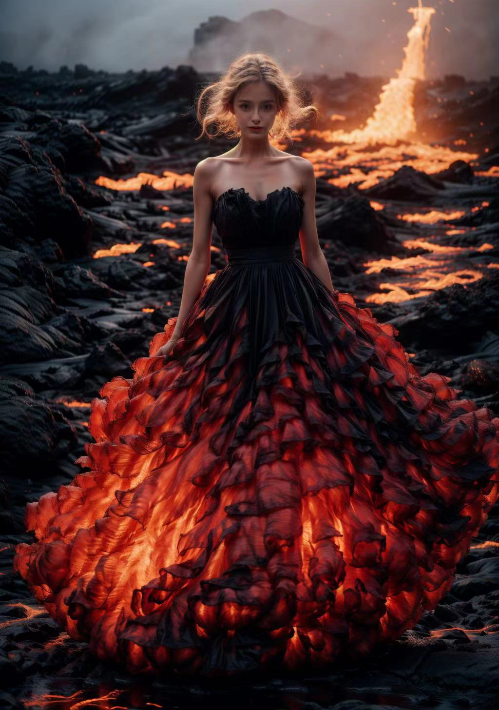

#### 换脸的方案
- roop
- 通过预训练用户脸模型lora
- 五官描述模型

##### 关于 roop
https://github.com/s0md3v/roop
stable diffusion有插件集成了roop
https://github.com/s0md3v/sd-webui-roop

pros
- 简易，一张source以及target图片就能直接替换
  
cons
- target的脸型，没办法去适应source，除非两者脸型很接近

##### 关于通过预训练用户脸模型lora
prob
- 生成只需要添加对应用户lora，生成的图片真实感更强，整体出来的效果很好
- 复用性很高
  
cons
- 训练成本较高
- 需要用户提供自己的照片

在实际中测试中，用户提供了120张左右图片。
用户提供图片的质量，对模型出产起了至关重要的作用（80% weight）
高质量的用户图，在20张左右就生成不错的模型。之后增加训练的样本，也并没有很质的飞跃。
可以增加一些人脸识别模型对用户提供图片进行评估，剔除质量不高的样本，保证没有 garbage in garbage out
参考 https://modelscope.cn/models/damo/cv_resnet50_face-detection_retinaface/summary
参考 https://github.com/ageitgey/face_recognition
上述训练使用了face_recognition进行了预处理
根据用户质量不同的模型，最后lora需要添加的权重也不同

额外补充: https://github.com/modelscope/facechain
在处理上，可以用更少的图片表现得更好

最后引用一张实际效果,脸与本人相似度接近95%

##### 官描述模型
引入五官模型，将用户的图通过tagger，生成对应描述词
直接根据一个通用五官模型，在五官上加入更详尽细分的描述。比如，丹凤眼，鹰钩鼻，类似侧写的方式。
暂时没找到成熟五官模型，搁置